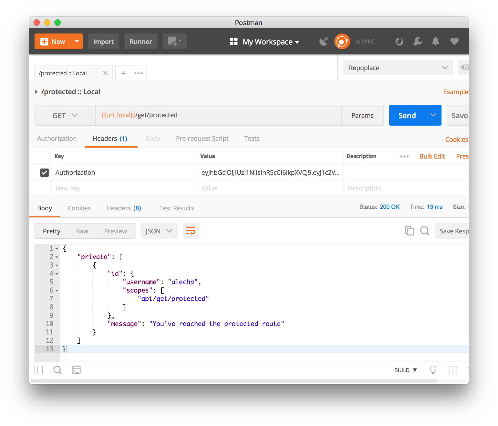

# AWS SLS Auth Starter

* **Shoutout**: Forked from [@yosriad/serverless-auth](https://github.com/yosriady/serverless-auth)
* **Purpose**: This is a serverless authorization example using JSON Web Tokens (JWTs)

---

### Routes

| Method | Endpoint              | Users with access | Header          | Body |
| :----- | :-------------------- | :---------------- | :-------------- | :--- |
| GET    | `api/get/public`      | All               | No              | No   |
| POST   | `api/mock/post/login` | All               | No              | Yes  |
| GET    | `api/get/protected`   | `alechp`          | `Authorization` | No   |

**Login Body**

```json
{
  "username": "alechp",
  "password": "123456"
}
```

### Sequence

1.  Login to get JWT (POST `api/mock/post/login`)

    > In order to pass the _authentication_ check, you will need to supply a valid JWT in your `Authorization` request header when making calls to a protected endpoint.

2.  Access authorized route (GET `api/get/protected`)
    > In order to pass the _authorization_ check, you will need a JWT belonging to a user with valid permissions. For this example, the user `alechp` is authorized to access `api/get/protected`. Unprivileged is not.

### Testing Locally

> You can test locally thanks to serverless-offline

**Automatically with Ava**

```bash
npm start
```

**Manually with Postman**

1.  Start Server

```bash
npm run slsoff
```


2.  Import Postman Collection
    a. Open Postman
    b. CMD+O (Open)
    c. Drag-and-drop `slsauth.postman_collection.json` into Postman modal

3.  Run tests


